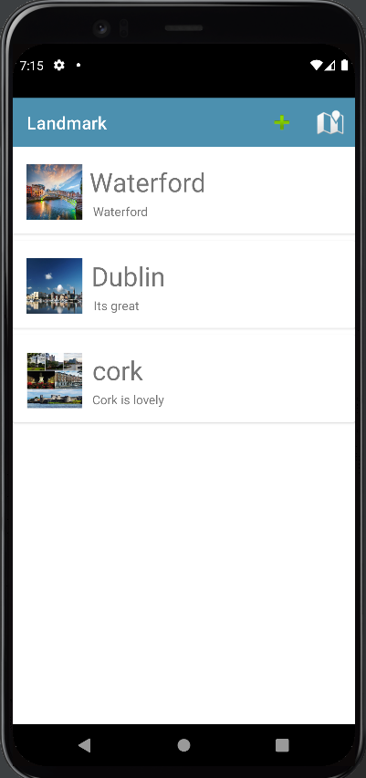
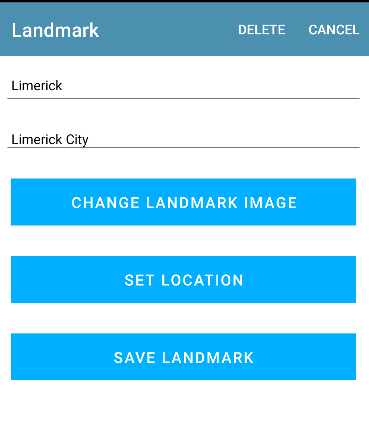
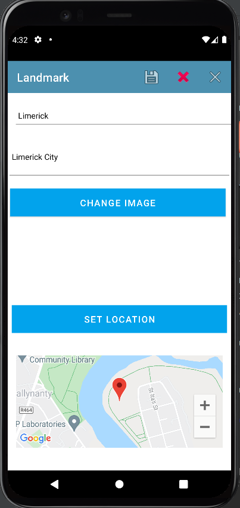
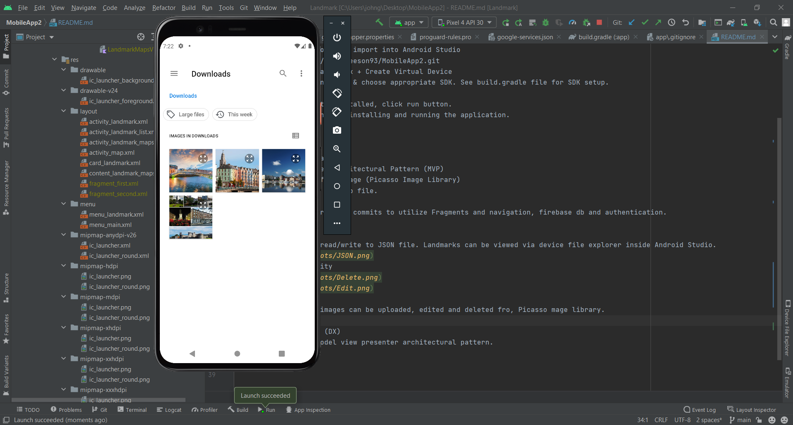
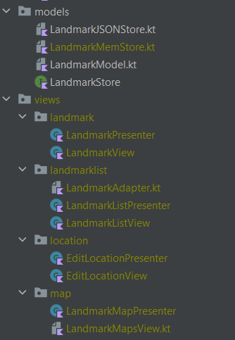
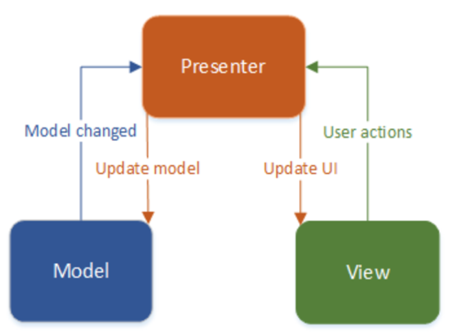

Landmark Application by John Gleeson 12349591

  A mobile application created using Android Studio using Kotlin.

Installation
  To run this project yourself:

  Clone this repository and import into Android Studio
  https://github.com/johngleeson93/MobileApp2.git
  Go to AVD Manager an click + Create Virtual Device
  Select device (phone) add & choose appropriate SDK. See build.gradle file for SDK setup.
  Click Next
  With Android Emulator installed, click run button.
  The emulator responds by installing and running the application.

Features
  Full CRUD Functionality
  Model View presenter architectural Pattern (MVP)
  Upload, Update profile image (Picasso Image Library)
  Data persists from JSON db file.

  Attempts made in previous commits to utilize Fragments and navigation, firebase db and authentication.

Persistent Storage
  This app utilises read/write to JSON file. Landmarks can be viewed via device file explorer inside Android Studio.
  
Full CRUD Functionality
  
  

  The Landmarks and images can be uploaded, edited and deleted fro, Picasso mage library.
  
Developer Experience (DX)
  The app utilises Model view presenter architectural pattern.
  

Class Diagram
  Here is a basic version of a class diagram for the mvp pattern for this landmark project. 
  
  
