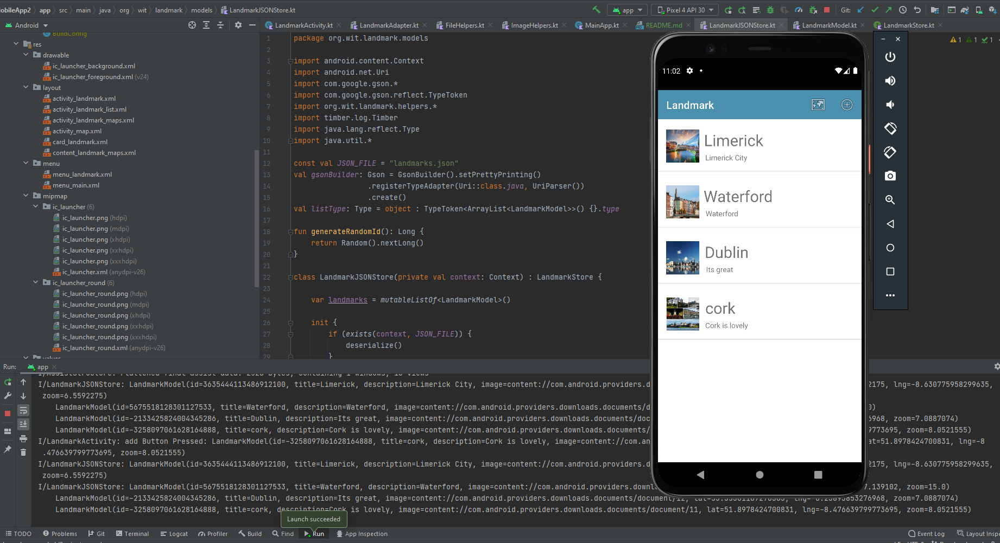
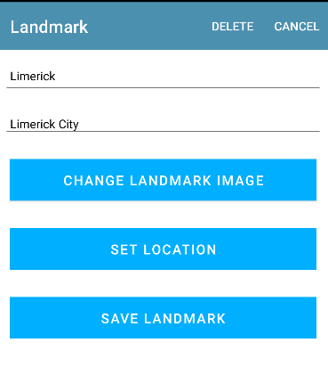

Assignment - LANDMARK App.
Mobile Application Development - Assignment Two

A mobile application create using Android Studio. The Android app that allows users to create, view, update and delete landmarks. Landmarks are saved and persist to JSON file.

Features
Create, Read, Update, Delete
Upload images (Picasso Image Library)
Landmarks stored locally in JSON
Adherence to Android Best Practices
Installation
To run this project yourself:

Clone this repository and import into Android Studio
https://github.com/johngleeson93/MobileApp2
Go AVD Manager an click + Create Virtual Device
Select device (phone) add choose appropriate SDK. See build.gradle file for SDK setup.
Click Next
With Android Emulator installed, click run button.
The emulator responds by installing and running the application.

Json storage

CRUD

Map View

